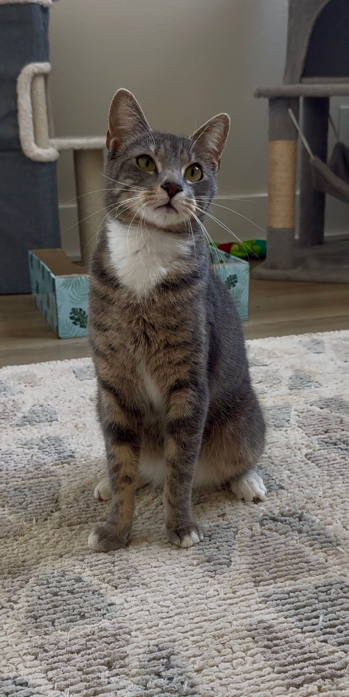

# Gravity == DevName
Computer Science Grad

The toughest part of any project is learning the concepts it requires. This profile comes from coursework, experiments, and side projects — trying things, breaking them, working out how they function.

ML and computer vision experiments, graph-based analysis, and lower-level systems projects was work done during my years as an undergrad.
More recent focus on full-stack development — the skill set most directly aligned with what companies search for within qualified candidates.
### Bonus Cat Pic:

